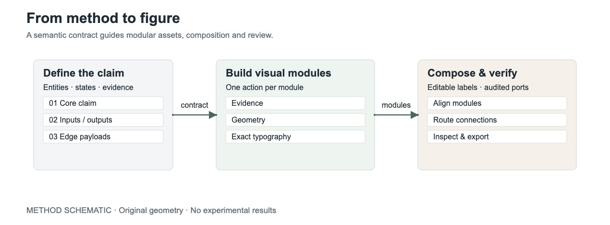
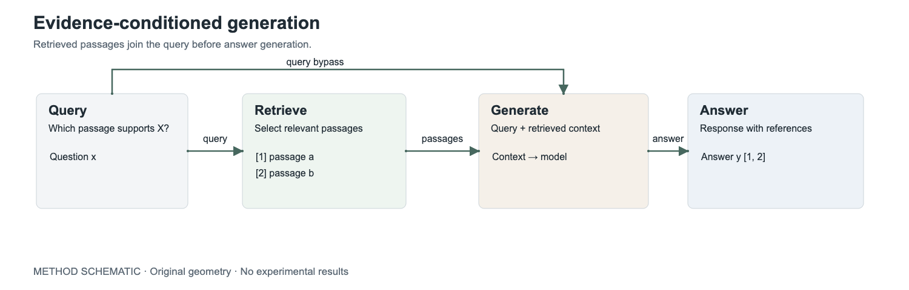
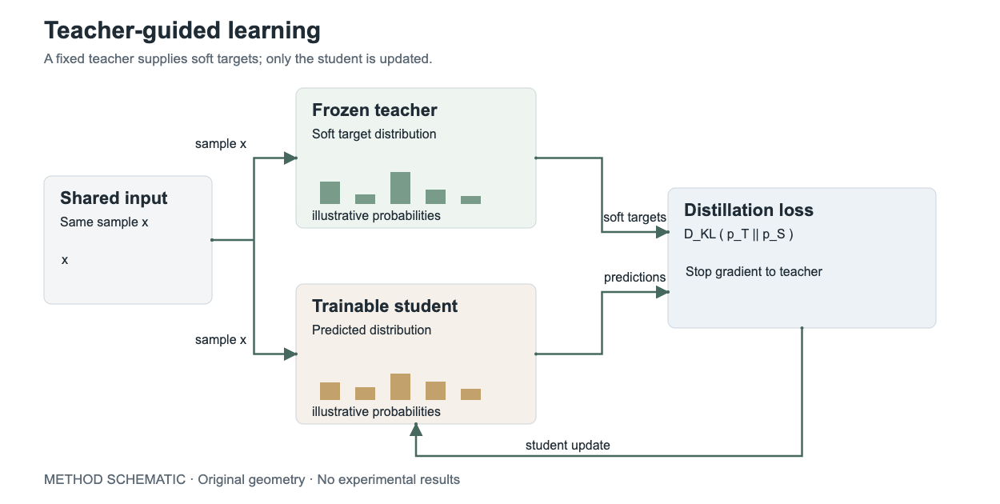

# Modular Figure Design

**Explain the method. Build the modules. Connect them precisely.**

A Codex skill for research method figures: semantic planning, focused visual assets, editable typography, and explicit connection review. Inspired by the restrained visual language of CVPR papers; useful across research domains.

[中文说明](README.zh-CN.md) · [Skill instructions](SKILL.md) · [Examples](examples/) · [Rendering guide](references/composition.md)



## What it does

- **Plan the argument:** identify the core claim, inputs, outputs, and the payload of each connection before drawing.
- **Build purposeful modules:** combine real evidence, generated visual inserts when useful, and exact geometry.
- **Keep precision editable:** typeset labels, formulas, legends, and cross-module arrows separately from generated assets.
- **Review the result:** trace semantic relationships, inspect the figure at its intended reading size, and audit annotated SVG connections.

The skill is an agent workflow, not a one-click diagram engine. Image generation is optional. The included renderer exports and checks authored HTML/SVG; it does not design layouts or verify scientific claims.

## Install

Clone into your Codex skills directory. Use a different destination if that folder already exists; do not overwrite a customized installation.

```bash
git clone https://github.com/znxzsy/modular-figure-design.git \
  "${CODEX_HOME:-$HOME/.codex}/skills/modular-figure-design"
```

Start a new Codex task and invoke `$modular-figure-design`. Reading and using the skill requires no Node dependencies. The optional HTML renderer requires Node.js, Playwright and Chromium.

## Try it

```text
Use $modular-figure-design to draw this method:
A query retrieves relevant passages. The query and passages both condition
answer generation, which produces an answer with references.

First save a plan and explicit edge specification, then build the figure.
Use editable labels and arrows, and mark all sample content as illustrative.
Deliver PNG, PDF, editable source, and separate visual modules.
```

For your own method, include the mechanism, inputs and outputs, what is new, any real assets, and the intended reading size. If you want only a plan, say so. For an iteration, identify what must stay unchanged.

## Examples

These are original **illustrative schematics**, not experimental results or claims about a particular implemented system. They use exact SVG geometry; no image model was used. They demonstrate different semantic structures, not the full range of generated visual assets the skill can work with.

### 1. The skill itself: semantic contract → modules → review

[Editable SVG](examples/workflow/figure.svg) · [PDF](examples/workflow/figure.pdf) · [Prompt and production note](examples/workflow/prompt.md)

### 2. Retrieval: evidence and query meet at generation



[Editable SVG](examples/retrieval/figure.svg) · [PDF](examples/retrieval/figure.pdf) · [Prompt](examples/retrieval/prompt.md)

The query bypass remains explicit: generation consumes both the original question and retrieved passages.

### 3. Distillation: a frozen teacher, a trainable student



[Editable SVG](examples/distillation/figure.svg) · [PDF](examples/distillation/figure.pdf) · [Prompt](examples/distillation/prompt.md)

Both models consume the same input. The loss compares distributions and updates only the student. The example deliberately omits task-specific losses and temperature scaling.

Each example includes `plan.md`, `figure-spec.json`, `caption.md`, `prompt.md`, HTML/SVG source, PNG/PDF exports, module crops, and a mechanical `review.json`.

## Reproduce the exports

Run from the repository root:

```bash
npm ci
npx playwright install chromium
node scripts/render_review.cjs \
  --input examples/retrieval/figure.html \
  --out /tmp/modular-figure-review --width 1500 --height 480
```

Use `1270 × 470` for workflow and `1250 × 630` for distillation. If Playwright or Chromium is already installed elsewhere, use `--playwright-module` and `--browser`; see [the rendering contract](references/composition.md).

The checker audits declared SVG edge endpoints, arrowheads, crossings with text or unrelated modules, asset loading, and figure bounds. Exit codes: `0` passed, `2` review issues, `1` runtime error. It cannot audit arrows baked into images, scientific correctness, or aesthetic quality. Always inspect the rendered output.

Edit the HTML as the renderer input; keep the standalone SVG synchronized if you change it. PDF output may mix vector and raster content when raster assets are embedded.

## How the skill is organized

| File | Purpose |
| --- | --- |
| `SKILL.md` | Core workflow and boundaries |
| `references/planning.md` | Narrative plan and connection specification |
| `references/prompting.md` | Per-module generation and local editing prompts |
| `references/composition.md` | Layout, ports, rendering and visual review |
| `scripts/render_review.cjs` | Optional renderer and mechanical checker |
| `examples/` | Complete, editable demonstration packages |

## Contributing

Useful contributions include examples with genuinely different method structures, reproducible renderer issues, and focused improvements to the workflow. Include the input, expected relationship, and a rendered preview. Share only assets you have permission to publish, and distinguish evidence from illustration.
